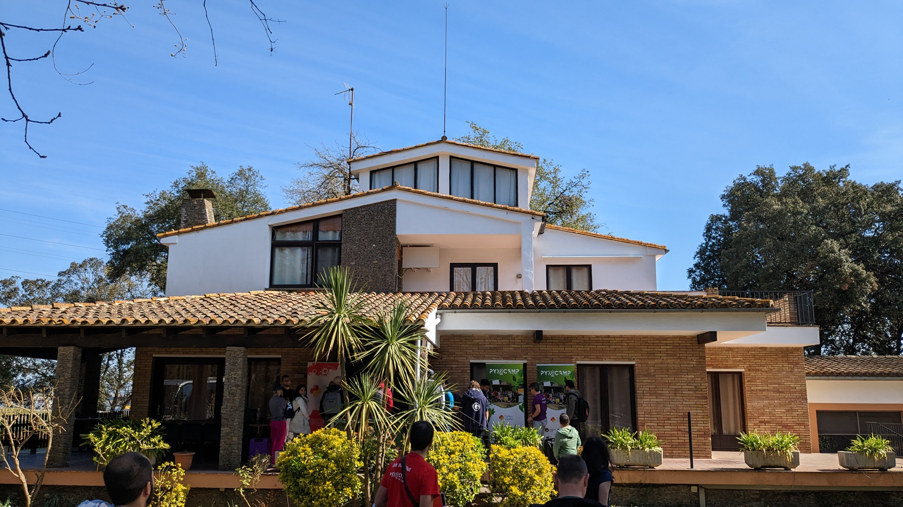
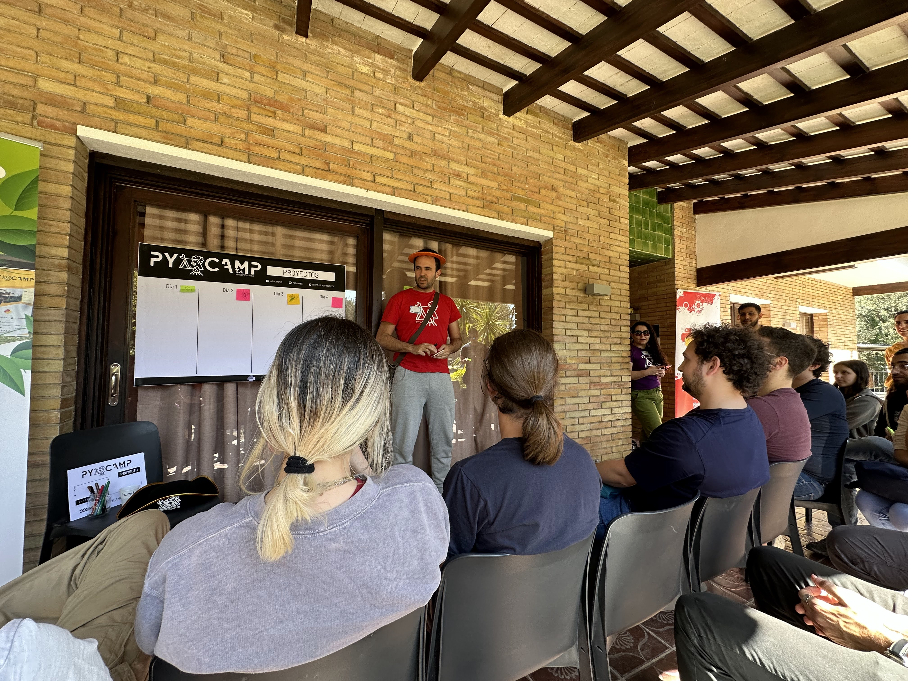
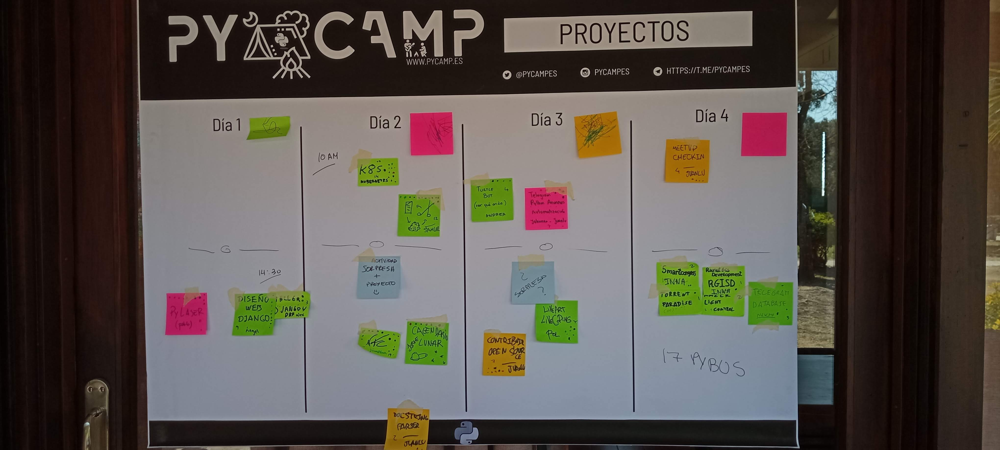
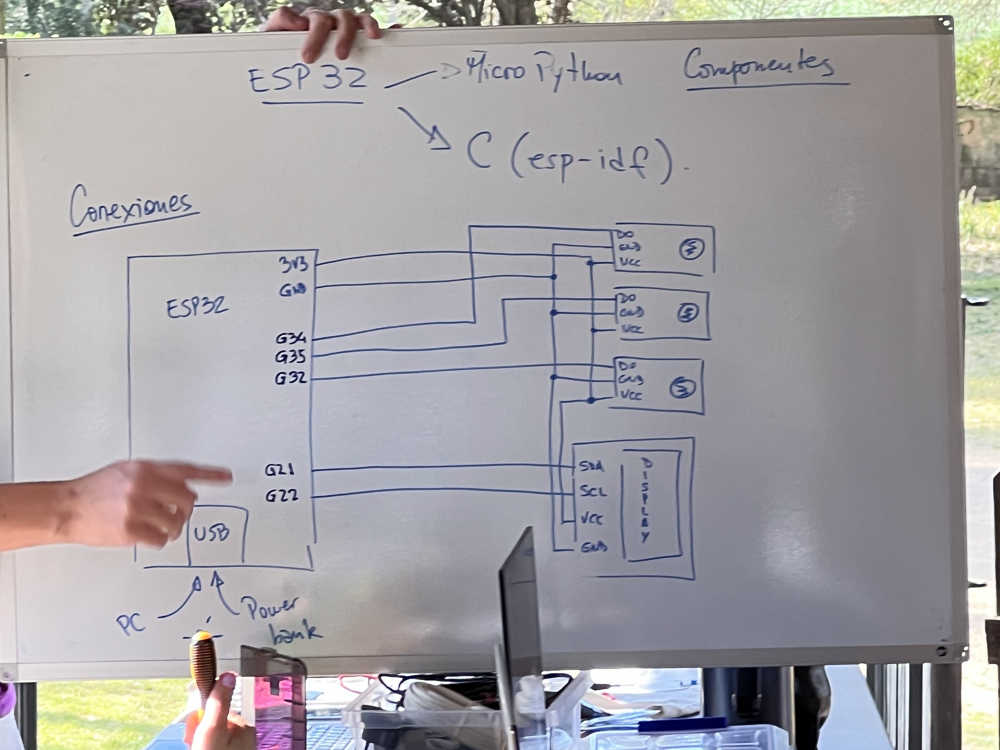
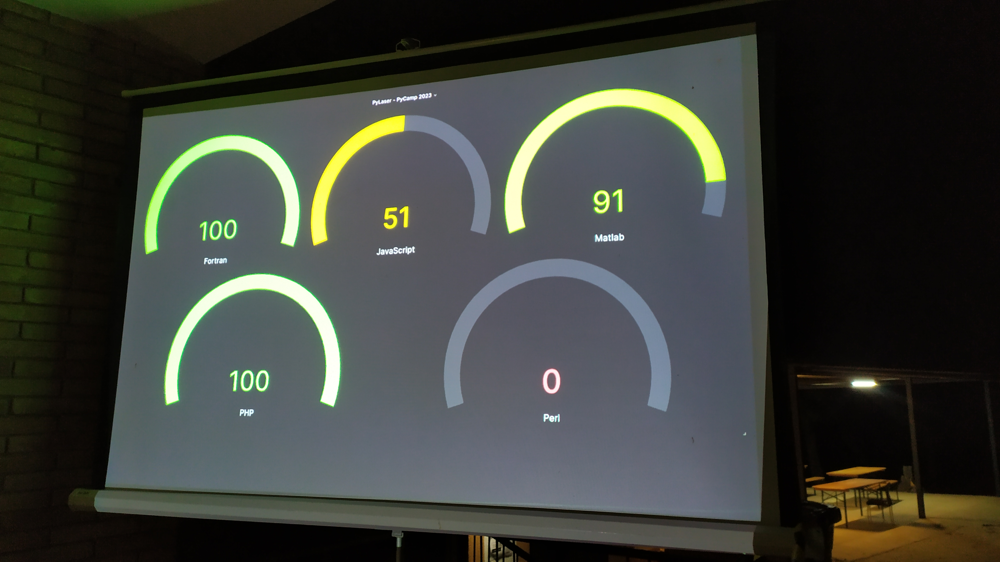

# Websites:
Google translated versions:
 1. [Spain](https://pycamp-es.translate.goog/?_x_tr_sl=auto&_x_tr_tl=en&_x_tr_hl=es&_x_tr_pto=nui)
 2. [Argentina](https://wiki-python-org-ar.translate.goog/pycamp/?_x_tr_sl=es&_x_tr_tl=en&_x_tr_hl=en&_x_tr_pto=wapp/)

Blog post about the Spanish 2022 edition:
https://dev.to/laysauchoa/pycamp-2022-going-camping-without-bugs-1ih1

# Link to repository

 
 
 
 
 
 
 
 
